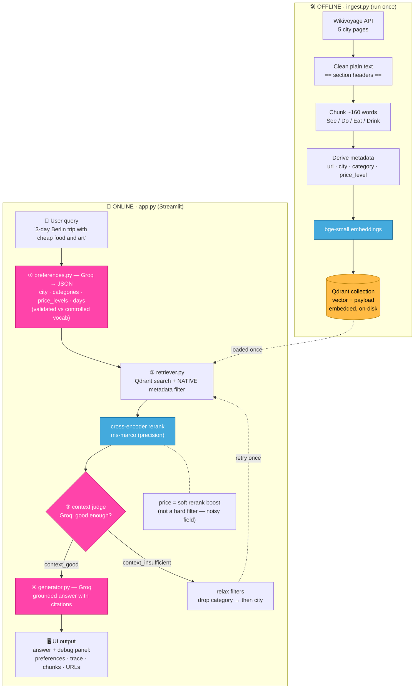
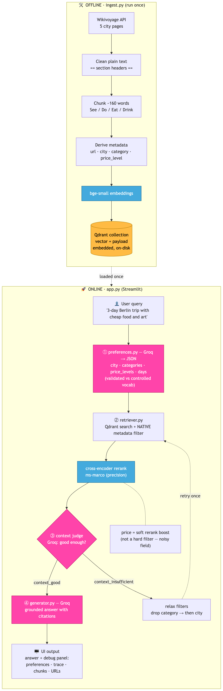
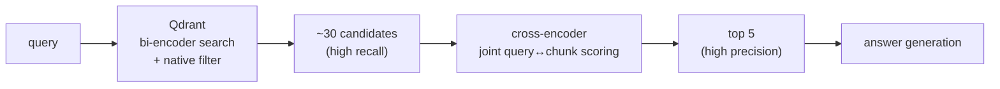
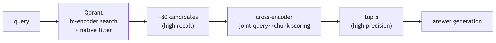
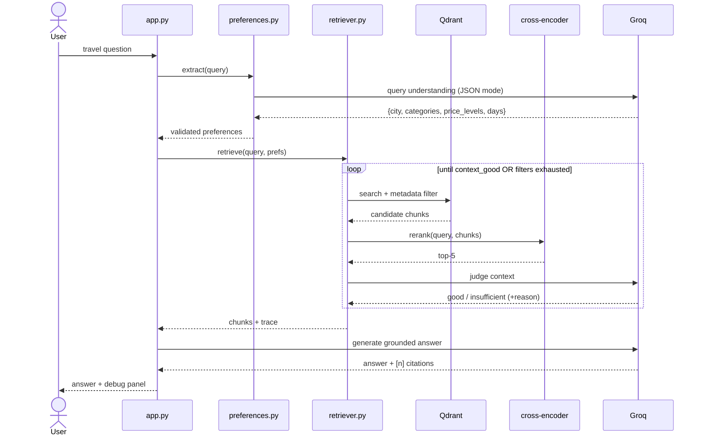
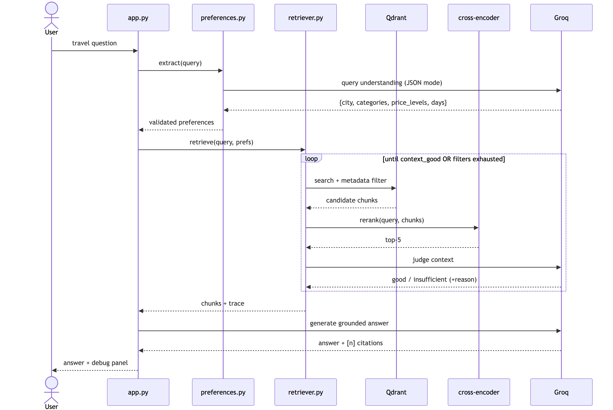

# Architecture — Preference-Aware Travel RAG Assistant

## System diagram

🖼️ PNG fallback (if your viewer doesn't render Mermaid)

**Legend:** 🟣 Groq LLM calls (`gpt-oss-120b`) · 🔵 local models (bge-small, cross-encoder) · 🟠 vector store (Qdrant).

## The 4 stages the UI must show

| Stage         | Module                      | Input → Output                               | LLM?                   |
| ------------- | --------------------------- | -------------------------------------------- | ---------------------- |
| **query**     | `app.py`                    | user text                                    | —                      |
| **retrieval** | `store.py` + `retriever.py` | query → filtered, reranked chunks            | rerank = cross-encoder |
| **reasoning** | `retriever.py`              | chunks → good/insufficient + relax decisions | judge = Groq           |
| **answer**    | `generator.py`              | query + chunks → grounded answer             | Groq                   |

## Two-stage retrieval (why recall then precision)

🖼️ PNG fallback (if your viewer doesn't render Mermaid)

- **Recall stage** (Qdrant bi-encoder + native filter): fast; casts a wide net inside the metadata filter. Query and chunk are embedded _separately_.
- **Precision stage** (cross-encoder): slower but accurate; re-scores the ~30 candidates _jointly_ and keeps the best 5. No single model does both well at scale — hence the split.

## Request sequence

🖼️ PNG fallback (if your viewer doesn't render Mermaid)

