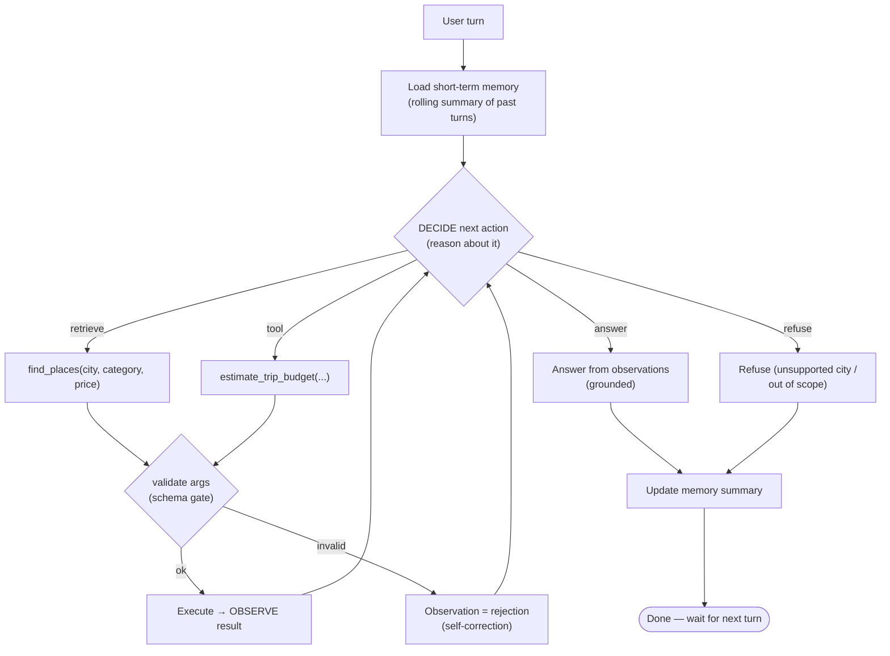
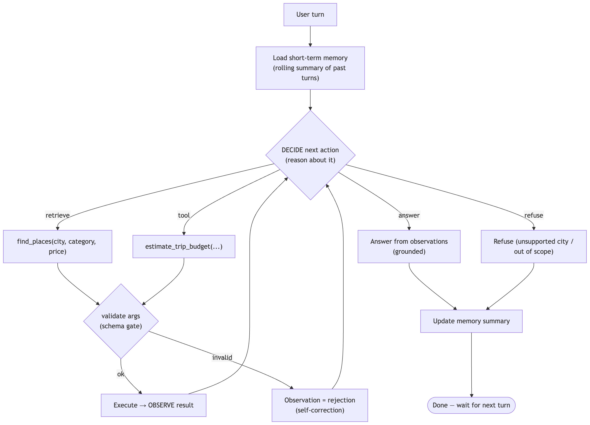

# Week 3 – Day 2 Report (Course Day 12) — Agent Patterns & Reasoning Strategies

## What we built

We refactored the Day-5 RAG pipeline (and the Day-11 tools) into an **explicit ReAct
agent loop** with **short-term memory**. Each user turn, the agent repeatedly decides
one of four actions — **retrieve / tool / answer / refuse** — executes it, observes the
result, and re-decides until it answers or refuses.

Files: [agent_loop.py](week-3/day-2/agent_loop.py) (the loop),
[memory.py](week-3/day-2/memory.py) (rolling summary),
[task.py](week-3/day-2/task.py) (5 conversations).

## 1. Agent flow diagram (the decision loop)

🖼️ PNG version (if your viewer doesn't render Mermaid)

**Read it as ReAct:** DECIDE = *reason*, retrieve/tool = *act*, "Execute → OBSERVE" = the
*observation* fed back into DECIDE. The loop only exits on `answer`/`refuse`.

## Concepts, grounded in this build

**Agent patterns.**
- **ReAct** (what we built): decide *one step at a time*, re-reasoning after each
  observation. Flexible for a chat assistant where each turn is unpredictable — but it
  can **wander/loop** (we saw the agent issue `find_places` 4× without answering).
- **Plan-and-execute**: draft the whole plan first, then run it. Fewer LLM calls,
  predictable — but brittle when a step's result surprises the plan. For open-ended
  single-turn Q&A, ReAct's adaptivity wins; for fixed multi-step workflows, plan-execute
  wins.
- **Tool-augmented agent vs pure RAG.** Pure RAG (Day 5) is a *fixed* pipeline: always
  retrieve → always generate. The agent *chooses* whether to retrieve, compute, answer,
  or refuse — so it handles budget math and out-of-scope cities that a fixed RAG can't.

**Memory.** Short-term = the rolling summary we carry between turns (cheap, resolves
"there"). Long-term = a persistent cross-session store (a vector DB of past chats) — we
didn't build it, but the same trade-off applies, amplified. **Memory helps** continuity
and **hurts** when its lossy/stale content bleeds into a new turn (examples 4–5 below).

**Trends (high level).**
- **Planner/executor separation** — split "what to do" from "how to do it" (a plan-execute
  refinement). We keep them in one model here for simplicity.
- **Reflection / self-correction** — the agent reacting to a rejected tool call *is* a
  minimal self-correction (validation → observation → re-decide). It's useful but
  **risky**: unconstrained, the same "look again and retry" impulse is what makes the
  agent **loop** (our 4× retrieve). Reflection without a stopping rule burns tokens and
  can talk itself out of a correct answer.

## 2. Five multi-turn examples

### ✅ Correct decisions (memory helps)

**Example 1 — coreference resolved by memory (C1).**
| Turn | Memory in | Decision | Right? |
| --- | --- | --- | --- |
| "3-day trip to Berlin. Cheap art?" | (empty) | retrieve `Berlin/art/cheap` → answer | ✅ |
| "And where can I eat cheaply **there**?" | "…3-day low-budget **Berlin** trip, affordable art" | retrieve `Berlin/food/cheap` | ✅ "there"→Berlin |

**Example 2 — context carried into a follow-up (C2).**
| Turn | Memory in | Decision | Right? |
| --- | --- | --- | --- |
| "Budget: 4 days, 2 people, 75 food, 40 activities?" | (empty) | tool → **€920** | ✅ |
| "What if we each also buy a **60 euro pass**?" | "4-day trip, 2 people, €75 food, €40 activities" | tool(`…one_off=60`) → **€1040** | ✅ carried days/travelers/rates |

**Example 3 — refuse, not overridden by momentum (C3).**
| Turn | Memory in | Decision | Right? |
| --- | --- | --- | --- |
| "Museums in Amsterdam." | (empty) | retrieve `Amsterdam/art` → answer | ✅ |
| "What about **Tokyo** — museums there?" | "…trip to **Amsterdam**…" | **refuse** | ✅ memory didn't push a bad retrieve |

### ❌ Memory caused a wrong decision

**Example 4 — category bleed (over-narrowing).**
| Turn | Memory in | Decision | Right? |
| --- | --- | --- | --- |
| "I **only care about art** — show me art in Paris." | (empty) | retrieve `Paris/art` | ✅ |
| "What **else** is worth seeing while I'm there?" | "…**art-focused** trip to Paris…" | retrieve `Paris/**art**` again | ❌ "else" means *beyond* art; memory's "only art" made it re-fetch art |

**Example 5 — price bleed (stale constraint).**
| Turn | Memory in | Decision | Right? |
| --- | --- | --- | --- |
| "Show me **cheap** art in Berlin." | (empty) | retrieve `Berlin/art/cheap` | ✅ |
| "I'm now thinking about Paris instead." | "…budget-friendly Berlin, cheap art…" | retrieve `Paris/art/cheap` | ✅ switched city |
| "What are the **best** museums there?" | "…budget Paris, **cheap** art…" | retrieve `Paris/art/**cheap**` | ❌ user asked for *best*, memory forced *cheap* |

**Why these two failed and the earlier switches didn't:** the agent **overrides memory
when the new turn is explicit** (it correctly flipped Berlin→Paris, and elsewhere
cheap→expensive when the user said "upscale"). Memory only wins when the new turn is
**silent** on the slot memory fills — "what else" (silent on category) and "best museums"
(silent on price). That's the precise danger of a lossy summary: it quietly supplies a
default the user never asked for.

## 3. Which pattern we implemented, and why

**We implemented ReAct** (reason → act → observe, one step at a time), not plan-and-execute.

- **Why ReAct fits:** a travel *chat* is turn-by-turn and unpredictable — a follow-up can
  switch city, add a constraint, or go out of scope. ReAct re-reasons after every
  observation, so it adapts within a turn (retrieve → see results → answer, or retrieve →
  invalid → self-correct). A plan-and-execute agent would commit to a plan before seeing
  the DB results and be wrong more often on these surprises.
- **The cost we paid for it:** ReAct's per-step freedom is exactly what let the agent
  **loop** (4× retrieve, no answer). A production version needs a stopping rule (max steps
  — we cap at 4) or a plan-execute hybrid for the parts that are actually fixed.

**Bottom line:** the agent loop made the system *more capable* than pure RAG (it can
compute, refuse, and follow context across turns), and short-term memory made multi-turn
conversation coherent — but memory added a new failure class (stale-slot bleed) and ReAct
added another (looping), both of which pure RAG simply couldn't have.
